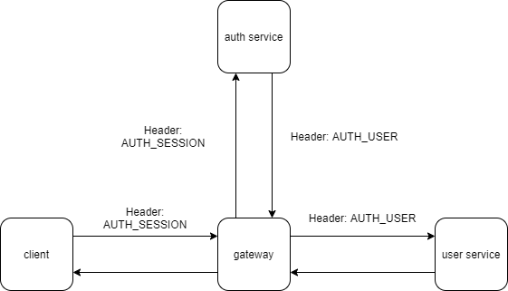

# Запуск

MongoDB statefull.
```
kubectl apply -f config.yml -f mongo.yml -f deploy.yml -f service.yml -f ingress.yml
```

Helm MongoDB.
```
helm install mongo bitnami/mongodb -f mongo_values.yml
kubectl apply -f config.yml -f deploy.yml -f service.yml -f ingress.yml
```

# Запросы
В файле gateway.json


